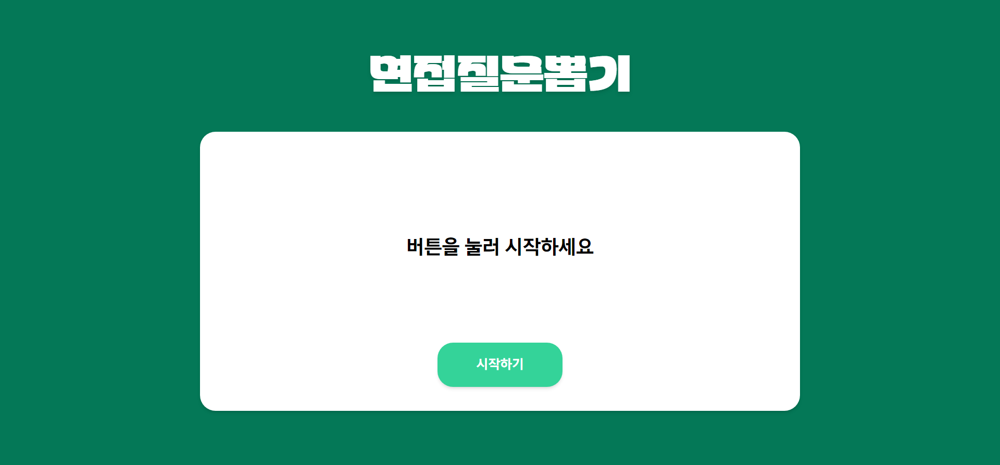
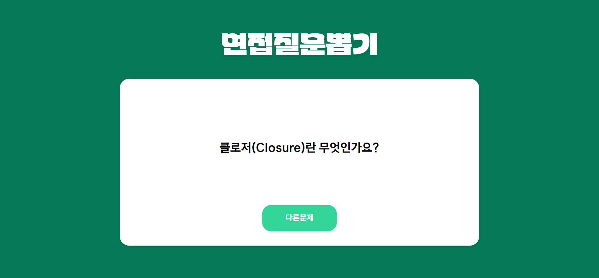

## [✏️ Interview DeepDive](https://interview-deep-dive.vercel.app)

### 신입 개발자들의 면접 준비를 도와주는 서비스입니다.

- 이 사이트는 [FEDeepDive 스터디](https://github.com/FEDeepDive/FrontEnd)에서 사용하기 위해 만들어 졌으며 질문 리스트는 스터디 범위 내에서 선정되었습니다.
- 질문리스트 관련 문의나 기능 관련 피드백은 이슈로 남겨주세요.

   

## 도입 예정인 기능들

- 타이머 기능
- 질문리스트 수정
- 질문 범위 선택
- 이전 질문 확인 기능
- CI/CD 구축
- SEO 구축 및 서비스 등록
- 카카오 봇 연동
- 백엔드 구축
  - 사용자 인증 및 권한관리 시스템 구현
  - 질문리스트 테이블 설계
  - 사용자 커스텀 질문

 

## 기술스택

- Webpack
- React
- TypeScript
- Tailwind
- Vercel
- eslint/prettier
